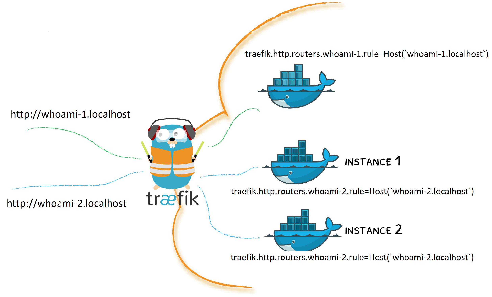

### Demo Traefik como reverse-proxy

Demo para probar el uso de Traefik como reverse proxy. Se expondran dos servicios (Container whoami) en un cluster Docker Swarm y se configurará Traefik para redireccionar el tráfico hacia cada uno de ellos dependiendo de la URL utilizada. 

## Traefik Dashboard
~~~
http://localhost:8090/
~~~

## En /etc/hosts
~~~
1. 127.0.0.1       whoami-1.localhost
2. 127.0.0.1       whoami-2.localhost
~~~

## Pruebas
~~~
Desde un navegador o utilzando curl, realizar requests a las URLs:
1. http://whoami-1.localhost
2. http://whoami-2.localhost

Se debería obtener información técnica sobre los containers donde se desplegaron los servicios.
~~~
